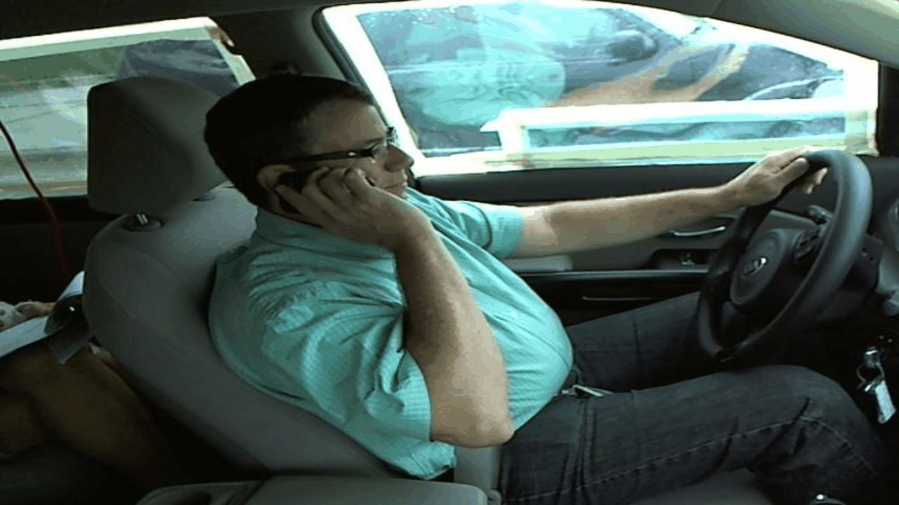
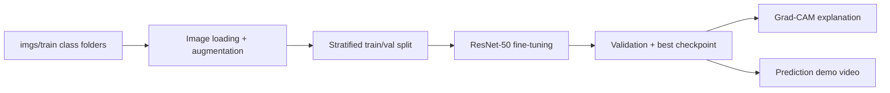
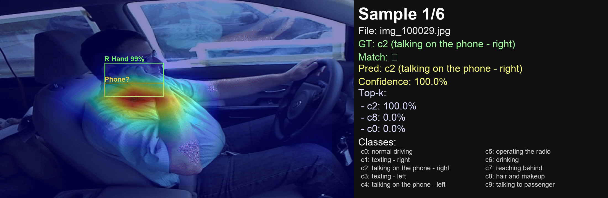

# TBD: To Be Detected

EECS 504 Computer Vision course project on still-image distracted driver detection using the State Farm Distracted Driver Detection dataset.


## Overview

This project studies whether a vision model can detect distracted driving behavior from a single image and which visual regions matter most for that decision. The implemented baseline uses full-image multiclass classification on the 10 distracted-driving classes, and Grad-CAM is used to verify whether the model attends to meaningful visual evidence.



## Methodology

The implemented baseline uses a **ResNet-50 image classifier** trained on the 10 distracted-driving classes (`c0` to `c9`). The approach is:

1. **Load images from folder structure**
  - Training images are organized by class folders under `imgs/train/c0` through `imgs/train/c9`.
  - Each folder name is treated as the label.
  - The test images used for demo playback are stored under `imgs/test`.

2. **Preprocess the images**
  - Resize images to $256 \times 256$.
  - Use random resized crop, horizontal flip, and color jitter for training augmentation.
  - Use center crop and ImageNet normalization for validation and visualization.

3. **Split the dataset**
  - The training folder is split into train and validation sets using a **stratified split by class**, so each class is represented in both sets.

4. **Train a ResNet-50 classifier**
  - Start from an ImageNet-pretrained ResNet-50 by default.
  - Replace the final fully connected layer with a new $10$-class classifier.
  - Optimize with **cross-entropy loss** and **AdamW**.

5. **Evaluate the model**
  - Track training and validation loss/accuracy each epoch.
  - Save the best checkpoint based on validation accuracy.

6. **Explain predictions with Grad-CAM**
  - Visualize which regions of the image influence the prediction most.
  - This helps verify whether the model looks at the driver, hands, phone, or other relevant regions.
  - Optionally overlay MediaPipe face and hand detections on top of the Grad-CAM heatmap as an independent verification layer, so the reviewer can visually check whether the model's attention aligns with semantically meaningful regions.

7. **Create a video demo**
  - Render a short `.mp4` showing model predictions on multiple images.
  - Show the predicted class, confidence, top-k scores, and ground-truth label when available.
  - Optionally generate a second video with Grad-CAM overlays.
  - Optionally generate a combined Grad-CAM + MediaPipe verification video where the heatmap is drawn on the full original image and face/hand/phone bounding boxes are drawn on top.

### Pipeline Summary



### Why this method

- **ResNet-50** is a strong and simple baseline for image classification.
- **Transfer learning** helps the model converge faster and work well on a smaller custom dataset.
- **Data augmentation** improves robustness to small appearance changes.
- **Grad-CAM** makes the results interpretable, which is important for safety-related driving applications.


## Motivation

Distracted driving is a major safety issue that contributes to preventable traffic accidents. Our goal is to explore how computer vision can support safer driving through image-based driver monitoring while keeping the system interpretable enough to understand what visual cues the model is using.

## Dataset

- Dataset: State Farm Distracted Driver Detection
- Source: Kaggle competition data
- Local training images: [`imgs/train`](./imgs/train)
- Local test images: [`imgs/test`](./imgs/test)

The training set contains 10 classes (`c0` through `c9`). In this repository, the baseline uses class-folder labels and a stratified random train/validation split.

## Project Questions

1. How well can a model detect distracted driving from a single still image?
2. Does focusing on driver-centered regions improve performance over full-image classification?
3. Do face, hand, and phone crops provide better visual evidence than the entire frame?
4. Is binary classification (`safe` vs `distracted`) more robust than fine-grained multiclass classification?
5. Does the model attend to semantically meaningful regions according to Grad-CAM?

## Planned Tasks

### 1. Baseline Classification

- Train a full-image multiclass classifier on the original 10 classes
- Train a full-image binary classifier with `c0` as `safe` and `c1-c9` as `distracted`

### 2. Region-Based Experiments

- Compare full-image inputs against driver-region crops
- Compare driver-region crops against tighter face/hand/phone-focused crops when available

### 3. Explainability

- Use Grad-CAM to visualize which regions contribute most to each prediction
- Check whether the model focuses on the driver, hands, and phone instead of irrelevant background cues

## ResNet-50 Baseline (Implemented)

- Script: `train_resnet50_baseline.py`
- Input format: folder-based classes under [`imgs/train`](./imgs/train) (`c0` to `c9`)
- Output:
  - best checkpoint: `outputs/resnet50_baseline/best_resnet50.pt`
  - training history: `outputs/resnet50_baseline/metrics.json`

### Quick Start

1. Install dependencies:

```bash
pip install -r requirements.txt
```

2. Run a short smoke test (fast sanity check):

```bash
python train_resnet50_baseline.py --epochs 1 --batch-size 8 --num-workers 0 --max-train-batches 5 --max-val-batches 2
```

3. Run full baseline training:

```bash
python train_resnet50_baseline.py --epochs 8 --batch-size 32
```

4. Optional: export penultimate-layer features for all `imgs/train` images:

```bash
python train_resnet50_baseline.py --epochs 8 --save-features outputs/resnet50_baseline/train_features.npz
```

### Training Details

- **Backbone:** ResNet-50
- **Initialization:** ImageNet pretrained by default
- **Classifier head:** new linear layer with 10 output classes
- **Loss:** cross-entropy
- **Optimizer:** AdamW
- **Input size:** $224 \times 224$ after resizing/cropping
- **Validation split:** stratified random split by class
- **Checkpoint selection:** best validation accuracy

### Grad-CAM Visualization

- Script: `gradcam_resnet50_baseline.py`
- Default checkpoint: `outputs/resnet50_baseline/best_resnet50.pt`
- Default output folder: `outputs/resnet50_baseline/gradcam`
- Output:
  - Grad-CAM overlay images
  - prediction summary: `gradcam_summary.json` (new summaries are appended on each run)

Generate a Grad-CAM overlay for one image:

```bash
python gradcam_resnet50_baseline.py imgs/train/c0/img_100026.jpg
```

Generate Grad-CAM overlays for a small batch of images from a folder:

```bash
python gradcam_resnet50_baseline.py --image-dir imgs/test --max-images 10
```

By default, Grad-CAM is generated for the predicted class. To visualize a specific class, pass a class name or index:

```bash
python gradcam_resnet50_baseline.py imgs/train/c0/img_100026.jpg --target-class c0
```

### Demo Prediction Video

- Script: `demo_video_resnet50_baseline.py`
- Purpose: create a short `.mp4` showing per-image predictions, confidence, and (when available) ground-truth labels inferred from parent class folders (`c0`-`c9`). It can also generate a second `.mp4` with Grad-CAM overlays for the same sampled frames.
- Layout: the image is shown on the left, while labels and probabilities are shown in a separate right-side panel so the image stays visible.
- Default sample count: 10 images.

Create a short demo from test images (unlabeled inference demo):

```bash
python demo_video_resnet50_baseline.py --image-dir imgs/test --max-images 20 --fps 2
```

Create a labeled demo from train images (shows GT vs prediction match):

```bash
python demo_video_resnet50_baseline.py --image-dir imgs/train --max-images 20 --fps 2 --output-video outputs/resnet50_baseline/demo_train_labeled.mp4
```

Create both the standard prediction demo and a second Grad-CAM overlay video:

```bash
python demo_video_resnet50_baseline.py --image-dir imgs/test --max-images 20 --fps 2 --output-video outputs/resnet50_baseline/demo_prediction.mp4 --gradcam-video outputs/resnet50_baseline/demo_prediction_gradcam.mp4
```

Create only the Grad-CAM overlay video without rewriting the standard demo:

```bash
python demo_video_resnet50_baseline.py --image-dir imgs/test --max-images 20 --fps 2 --gradcam-video outputs/resnet50_baseline/demo_prediction_gradcam.mp4
```

Create a labeled Grad-CAM demo from train images (shows GT vs prediction match plus overlay):

```bash
python demo_video_resnet50_baseline.py --image-dir imgs/train --max-images 20 --fps 2 --gradcam-video outputs/resnet50_baseline/demo_train_labeled_gradcam.mp4
```

### Grad-CAM + MediaPipe Verification Video

- Script: `demo_video_resnet50_baseline_gradcam.py`
- Purpose: render a Grad-CAM video where the heatmap is overlaid on the **full original image** at its native resolution and MediaPipe face/hand detections (plus a `Phone?` heuristic box for the phone classes `c1`–`c4`) are drawn on top as an independent visual ground-truth layer. When the Grad-CAM hot region aligns with a detected hand, face, or phone box, that is a visual confirmation that the model is attending to the right region; when it does not, the frame is a failure case worth investigating.
- Layout: same left-image / right-panel layout as the standard demo video, with the new detection overlays rendered directly on the image.
- Default checkpoint: `outputs/resnet50_baseline/best_resnet50.pt`

Generate only the combined Grad-CAM + MediaPipe verification video (the standard prediction video is not written when only `--gradcam-video` is passed):

```bash
python demo_video_resnet50_baseline_gradcam.py \
  --image-dir imgs/train/c1 \
  --max-images 5 \
  --gradcam-video outputs/resnet50_baseline/demo_gradcam_combined.mp4
```

Generate the combined video alongside the unchanged standard prediction video:

```bash
python demo_video_resnet50_baseline_gradcam.py \
  --image-dir imgs/train \
  --max-images 20 \
  --output-video outputs/resnet50_baseline/demo_prediction.mp4 \
  --gradcam-video outputs/resnet50_baseline/demo_gradcam_combined.mp4
```

Disable the MediaPipe verification overlay (Grad-CAM heatmap only, no bounding boxes):

```bash
python demo_video_resnet50_baseline_gradcam.py \
  --image-dir imgs/train/c1 \
  --max-images 5 \
  --gradcam-video outputs/resnet50_baseline/demo_gradcam_nodet.mp4 \
  --no-detect
```

Sweep all 10 classes (5 images each) to visually verify Grad-CAM attention against MediaPipe detections across the full label set:

```bash
for c in c0 c1 c2 c3 c4 c5 c6 c7 c8 c9; do
  python demo_video_resnet50_baseline_gradcam.py \
    --image-dir imgs/train/$c \
    --max-images 5 \
    --gradcam-video outputs/resnet50_baseline/demo_gradcam_combined_$c.mp4
done
```

Notes:
- The phone-region heuristic box is gated on `PHONE_CLASSES = {c1, c2, c3, c4}`, so it only appears for phone-related predictions. For `c0` (normal driving) and `c5`–`c9`, expect only face and hand boxes.
- The Grad-CAM heatmap is upsampled from the 7×7 `layer4` activation back to the original image resolution by inverting the model's `Resize(256) → CenterCrop(224)` pipeline, so pixels outside the model's crop receive a zero heatmap value and remain visually unchanged in the overlay.

## End-to-End Project Pipeline

1. **Organize the dataset** into class folders `c0` to `c9`.
2. **Train the baseline** with `train_resnet50_baseline.py` on `imgs/train`.
3. **Split the training set randomly by class** into train and validation subsets.
4. **Save the best checkpoint** and training metrics from validation accuracy.
5. **Run Grad-CAM** with `gradcam_resnet50_baseline.py` to inspect attention regions.
6. **Create the demo video** with `demo_video_resnet50_baseline.py` using `imgs/test` for unlabeled inference or `imgs/train` for labeled playback.
7. **Compare results** using training/validation accuracy and qualitative visual explanations.

## Model Recommendations

### Primary Model

- **ConvNeXt Tiny**
  - Best overall balance of ease of use, speed, and performance
  - Good main model for final experiments

### Strong Baseline

- **ResNet50**
  - Easy to train, debug, and explain
  - Good first baseline and well suited for Grad-CAM

### Optional Comparison

- **EfficientNet V2-S**
  - Strong accuracy candidate
  - More computationally demanding than the two models above

## Evaluation Plan

- Use stratified train/validation splits by class from `imgs/train`
- Report accuracy for binary and multiclass setups
- Compare full-image and crop-based models under the same split protocol
- Include qualitative Grad-CAM visualizations for correct and incorrect predictions
- Analyze common failure cases, including background bias and driver-specific overfitting

## Expected Deliverables

- A working still-image distracted driver classification prototype
- Quantitative comparison of:
  - full image vs driver-region crops
  - crop-based variants
  - binary vs multiclass classification
- Grad-CAM visualizations showing model attention
- Final course report and presentation video

## Positive Impact

If successful, this project could inform the design of low-cost driver monitoring systems that detect distraction early and support safer driving. More broadly, it explores how interpretable computer vision tools can contribute to reducing preventable accidents caused by inattention.

## Team

- Team name: **TBD: To Be Detected**

## Example Output — Grad-CAM + MediaPipe Verification

The animation below is generated by `demo_video_resnet50_baseline_gradcam.py` on the **same 5 sample frames** from `imgs/train/c1` (texting — right) used by the top-of-page GIF. The top GIF is the standard prediction demo with no explainability overlays (our "before"); this one is the processed version (our "after") where each frame shows the Grad-CAM heatmap overlaid on the full original image at native resolution, with MediaPipe face/hand detections and the `Phone?` heuristic box drawn on top as an independent verification layer.


